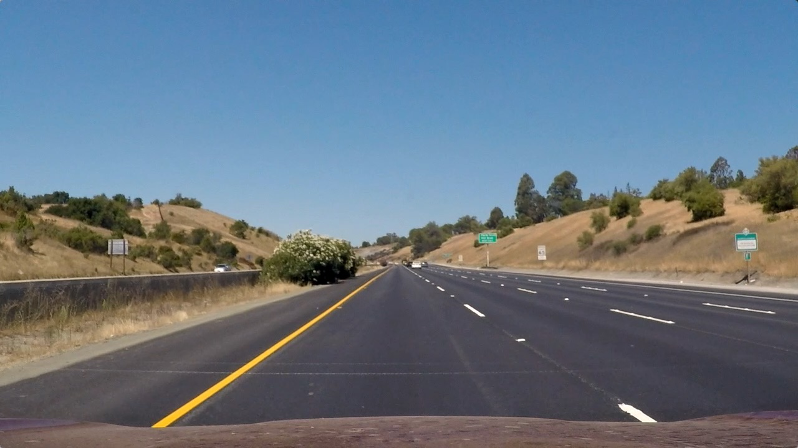

## Self-Driving Cars Nanodegree Project 4 - Advanced Lane Detection

**This is my work for the Advanced Lane Detection project of the Udacity Self-Driving Cars Nanodegree. The project in cludes an algorithm pipeline implementing following functions:**

* Compute the camera calibration matrix and distortion coefficients given a set of chessboard images.

* Apply a distortion correction to raw images.

* Use color transforms, gradients, etc., to create a thresholded binary image.

* Apply a perspective transform to rectify binary image ("birds-eye view").

* Detect lane pixels and fit to find the lane boundary.

* Determine the curvature of the lane and vehicle position with respect to center.

* Warp the detected lane boundaries back onto the original image.

* Output visual display of the lane boundaries and numerical estimation of lane curvature and vehicle position.

**The work has been tested on a video at:**

|  |
| :--------------------------------------: |
| [Youtube Link](https://youtu.be/cEmriDpCg1k) |

---
### Quick Start

The pipeline includes two scripts *utils.py* and *video_lane_detection.py*, in which *util.py* includes implementations of functions of the pipeline and the pipeline is applied to videos in *video_lane_detection.py*. Parameters of the pipeline are set in *video_lane_detection.py* as well.

### Camera Calibration

#### 1. Briefly state how you computed the camera matrix and distortion coefficients. Provide an example of a distortion corrected calibration image.

The camera can be calibrated using OpenCV's functions *cv2.findChessboardCorners(*),* cv2.calibrateCamera()*, and *cv2.undistort()*, which have been packaged in *findCorners()*, *objP()*, *mapPoints()*, and *calUndistort()* in *utils.py*. With given chessboard images, we can extract coordinates of corners in 3D space and in the 2D image. These points will be used to generate the distortion coefficients and camera matrix, which will be applied to undistort each image input to the pipeline. One of the original calibration image is shown below along with its undistorted image.

|             calibration3.jpg             |       undistorted calibration3.jpg       |
| :--------------------------------------: | :--------------------------------------: |
|  |  |

### Pipeline

#### 1. Image undistortion on test images

The camera calibration and image undistortion are demonstrated on the provided test image *straight_lines1.jpg* below

|           straight_lines1.jpg            |     undistorted straight_lines1.jpg      |
| :--------------------------------------: | :--------------------------------------: |
|  |  |

#### 2. Image filtering

I have used the combination of following filters to extract lane lines from an input image.

* Sobel filters in X and Y direction
|              sobel filter x              |              sobel filter y              |
| :--------------------------------------: | :--------------------------------------: |
|  |  |
* The magnitude and direction of the gradient
|          magnitude of gradient           |          direction of gradient           |
| :--------------------------------------: | :--------------------------------------: |
|  |  |
* The H and S channels of the image in HLS space
|              HLS S channel               |              HLS H channel               |
| :--------------------------------------: | :--------------------------------------: |
|  |  |

The filters I have used have been wrapped up in functions *sobel_thresh()*, *sobel_mag_thresh()*, *dir_thresh()*, *grad_thresh()*, and *hls_thresh()*. All gradient-based filters have been packaged up in *grad_thresh()*, which is then combined with the color-based filters in *img_thresh()*. The final binary image produced by the combined filter is demonstrated below.

|           straight_lines1.jpg            |   binary image of the combined filter    |
| :--------------------------------------: | :--------------------------------------: |
|  |  |

#### 3. Perspective transform
The perspective transform is completed by *img_warper()* in *utils.py*, in which the OpenCV functions *cv2.getPerspectiveTransform()* and *cv2.warpPerspective()* are packaged.

Four points on the straight lane lines of the original binary image and the correlated points on the transformed perspective were chosen to calculate the perspective transform matrix. The point chosen are 

| Source     | Target     |
| ---------- | ---------- |
| (213,700)  | (300,700)  |
| (592,450)  | (300,20)   |
| (687,450)  | (1000,20)  |
| (1090,700) | (1000,700) |

The original binary image and the perspective transformed images are shown below. The transform is correct, because straight lane lines have been maintained parallel in the transformed image.

#### 4. Lane pixel detection

The lane pixel detection is done by a sliding window search implemented in functions *findLines()*, *findLines_poly()*, and *laneFit()* in *utils.py*. *findLines()* performs the sliding window search across the whole image, which is used in cases that no lane line has been detected in previous images. *laneFit()* fits polynomial functions to the detected lane pixels of the image. *findLines_poly()* searches around two input lines, which is faster and likely to produce better results.

The result of findLines() and findLines_poly() are shown below. 

|          results of findLines()          |       results of findLines_poly()        |
| :--------------------------------------: | :--------------------------------------: |
|  |  |

#### 5. Curvature radius and vehicle offset calculation

The equation of curvature radius calculation can be found at [here](https://www.intmath.com/applications-differentiation/8-radius-curvature.php). This function is implemented in the *utils.py* function along with the polynomial fitting, and the vehicle offset calculation is implemented in *vehOffset()* in *utils.py* as well.

#### 6. Results plotted back

The detected lane lines can be plotted back to the original image using the inverse perspective transform obtained along with the perspective transform matrix in *img_warper()*. The curvature radius of an image is the average of those calculated for each lane. Results of those images on tested images are shown below.

  
