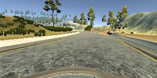
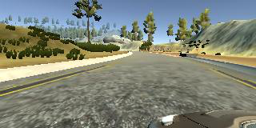
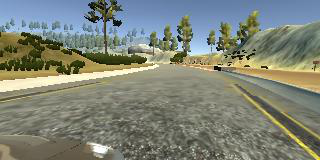
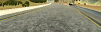
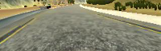
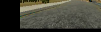
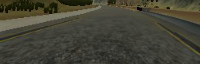
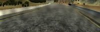
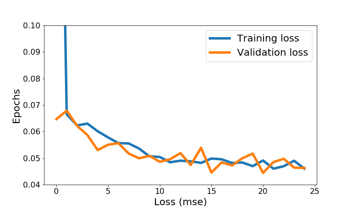

#**Udacity Self-driving Cars NanoDegree Project 3: Behavioral Cloning** 

##Summary

**This is my work for the Behavioral Cloning project of the Udacity Self-driving Cars Nanodegree. A ConvNet-based model was built to autonomously predict steering of a simulated car. The architecture of this model is based on [Nvidia's End to End Learning for Self-Driving Cars](http://images.nvidia.com/content/tegra/automotive/images/2016/solutions/pdf/end-to-end-dl-using-px.pdf). However, several adjustments have been made on the architecture to improve the performance on my dataset, and were documented in this documented. Although Udacity has provided some data, I decided to collect my own dataset using Udacity's [car simulator](https://github.com/udacity/self-driving-car-sim). In this project, I have generated a very small dataset of 2700 images on purpose, and augmented it with several data augmentation strategies to train my model. My model has been tested on the basic track provided in the simulator, indicating that data augmentatation can stretch the limit of a small dataset. Results of the model are shown below. This model does not make too far on the challenge track, which is longer and with more sharp turnings. Data augmentataion cannot help on this complex problem, and a much larger dataset are required.**


|                Lake Track                |
| :--------------------------------------: |
| [](https://youtu.be/Q-5QoDszvWQ) |
| [YouTube Link](https://youtu.be/Q-5QoDszvWQ) |

---

##Project Description

This project includes:
* Data Collection and Preprocessing
* Data Augmentation
* Model Architecture
* Model Training
* Discussion

### Quick Start

The environment for this project can be installed following Udacity's [CarND Term1 Starter Kit](https://github.com/udacity/CarND-Term1-Starter-Kit). Following files are used to build this model:
* model.py: build the model
* drive.py: run a pretrained model
* util.py: functions defined for preprocessing and image augmentation
* model.h5: my pretrained model

**Run the pretrained model**
Start Udacity's car simulator, choose the basic track and the Autonomous Mode. The simulated car will be ready in the track. Then open a terminal and run the model using
```python
python drive.py <model file>
```
A preliminary versioin of drive.py was provided by Udacity, but I have added a line with image cropping.

**Train the model**
To train the model, the path to the training data set must be set for the list `path` in `model.py`. Once path has been set, just run the model with
```python
python model.py
```
---
### Data Collection and Preprocessing

We can collect data using the Training Mode of the simulator by capturing photos from three cameras set on the simulated car. The total numbers of images captured for each tracks are listed in the table below. This is a very small dataset, but I have tried to maximize the value of this dataset with image augmentation. This got the model to work on the basic track, but did not make too far on the challenge track with many sharp turnings.

|Tracks        | Number of Images        |
|--------------|-------------------------|
|Track 1       |2787                     |

The steering angle of the center camera was recorded along with the photos. Examples of pictures of three cameras taken at the same time are shown below.

|**Center Camera**|**Left Camera**|**Right Camera**|
||||

I only collect photos fron three to four rounds on the track, since image augmentation will be applied. While driving on the track, I constantly changed the car from the border of the track to the center. More data steering the car back to the center were recorded in this way. The images have been cropped to focus on the road, and resized to reduce the dimension of the data. The cropped center image above is shown below. In addition, a normalization layer was set in the model to normalize the input image.

  

### Data Augmentation

Several strategies have been applied on the original images to increase the size of our samples and to generalize our data for cases such as sharp turnings. The strategies used are listed below.
* Use of images from the left and right camera. A image was randomly selected from the center, left, and right images captured at the same time. Since the images have been shifted, steering correction has been applied by adding 0.2 to the left image and subtracting 0.2 from the right image.

* The selected image was randomly flipped. The trained model tended to drive on the left side of the track without flipped data, since the data was collected while driving clockwise on the track.

  

* We randomly shifted the data horizontally and vertically. This strategy is equavallent to increasing more sharp turning data. The steering angle of a shifted image must be corrected. In this project, I assume that the correction is linearly correlated to the horizontal offset.

  

* The brightness of the image has been added in order to avoid overfitting on the data.

  

* A Gaussian noise has also been added to avoid overfitting.

  

### Model Architecture

My network is based on the architecture of [Nvidia's End to End Learning for Self-Driving Cars](https://github.com/udacity/CarND-Term1-Starter-Kit). However, several adjustments have been made in order to improve the results on my dataset.
* The input images were converted in HSV plane rather than YUV suggested in the paper
* The input image resolution is 64x200x3
* Maxpooling layers were used insteal of subsampling in convolutional layers
* Same padding was used instead of valid padding
* A dropout layer was added between the flattened layer to the fully-connected layers
* Numbers of parameters were increated in fully-connected layers, since I have more parameters out of the convolutional layers than the original architecture

My final architecture is documented below. Based on my experiments, it is important to ensure that no pooling or subsampling has been applied following the last two convolutional layers in order to get a significant improvement on the performance.

| Layer           | Output Shape        | Number | Connected to | Filter size |
| --------------- | ------------------- | ------ | ------------ | ----------- |
| lambda layer    | (None, 64, 200,  3) | 1      | Input layer  |             |
| Convolution2D   | (None, 64, 200, 24) | 2      | 1            | 5           |
| MaxPooling2D    | (None, 32, 100, 24) | 3      | 2            |             |
| Convolution2D   | (None, 32, 100, 36) | 4      | 3            | 5           |
| MaxPooling2D    | (None, 16,  50, 36) | 5      | 4            |             |
| Convolution2D   | (None, 16,  50, 48) | 6      | 5            | 5           |
| MaxPooling2D    | (None,  8,  25, 48) | 7      | 6            |             |
| Convolution2D   | (None,  8,  25, 64) | 8      | 7            | 3           |
| Convolution2D   | (None,  8,  25, 64) | 9      | 8            | 3           |
| Flatten layer   | (None, 12800)       | 10     | 9            |             |
| Dropout         | (None, 12800)       | 11     | 10           |             |
| dense_1 (Dense) | (None, 1000)        | 12     | 11           |             |
| dense_2 (Dense) | (None, 500)         | 13     | 12           |             |
| dense_3 (Dense) | (None, 100)         | 14     | 13           |             |
| dense_4 (Dense) | (None, 1)           | 15     | 14           |             |

### Model Training

Sine this dataset is small, I did not split it to training and validation set. The training and validation generators were both created with all of the images on the basic track. Since each of the image will be stochastically augmented, my assumption is that I can stochstically generate a traning set and a validation set with the generators. The training:validation ratio is 4:1. The model was tested on the simulator, and works for the simple basic track. However, this strategy only works for simple tracks. For the complex challenge track, much more data are required to train a valid model.

Hyperparameters for training are documented below:
* The training data size is chosen to be around 20000. This gives the best performance in combination with the batch size of 128
* My best model is obtained after 20 epochs
* [The Adaptive Momentum Estimation (Adam)](https://arxiv.org/pdf/1412.6980v8.pdf) optimizer is chosen for the training. Adam updates every parameter in the model with an individual learning rate, which has simplified the tuning for learning rate. In the project, we chose a relatively fast learning rate 1e-3, and let Adam to adapt themselves through the training process. We don't need to worry about the learning rate decay with Adam. The training loss and validation loss are shown below. The initial training loss is very large, because I have assigned a high learning rate. Since Adam has adjusted every weight individually, training loss and validation loss are similar starting from the second epoch.

  

### Discussion

A small data set of the basic track have been used to train my networks with augmentation, and the model works on this track. However, using a small dataset for the challenge track, which is much longer and consists of more sharp turnings, does not generate a valid model. More data are required for this complex track.
