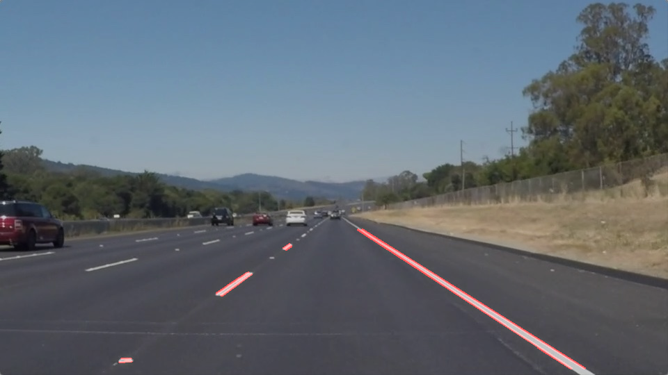
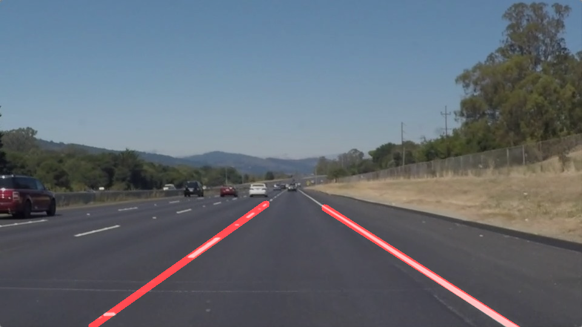

# **Finding Lane Lines on the Road** 

## Summary

### This paper documented a Python pipeline finding lane lines from images and videos taken by a camera set in the front of the vehicle. This pipeline integrated image processing tools including color filter, Canny filer, and Hough transform, and it has been tested with images and videos. This is also a project of the Udacity Self-driving car Nanodegree.
***

The steps of this project are listed as follows:

1. Make a pipeline with RGB color filter that finds lane lines on the road
	* Test the pipeline with multiple images
	* Test the pipeline with a video clip
2. Improved the pipeline to fit lines along the extracted lane lines
	* Test the improved pipeline with a video clip
3. Apply HSV color filter in the pipeline for better line extraction
	* Test the new pipeline with a video clip with more complex colors on the road surface

---

## Reflection
### 1. Pipelines
#### 1.1 A simple pipeline with RGB color filter.
In this pipeline, images taken from a camera set in front of a vehicle was loaded in RGB format by `matplotlib.image.imread()`. Notice that an image was loaded by `OpenCV cv2.imread()`, it would be in BGR format.

My basic pipeline to extract lane lines is implemented as follows. This pipeline start with RGB color filter. Yellow pixels are selected by `cv2.inRange(img, colorLower[0], colorUpper[0])`, and white pixels are selected by `cv2.inRange(img, colorLower[1], colorUpper[1])`. A pixel mask was obtained by calculate the union of two colors by `cv2.bitwise_or()`. The original image was masked out using `cv2.bitwise_and()` with the mask. The masked-out image was converted to gray scale for Canny edge detection. A Gaussian blurring step was applied before Canny edge detection in order to enhance the results. Hough transform was applied to extract lines from results of Canny edge detection within a given region of interests. By default, the pipeline return an image with raw lane lines.
```python
def findLane(img, colorLower, colorUpper, cannyLow, cannyHigh, kernel_size, vertices, rho, theta, threshold, min_line_len, max_line_gap, fitLines = False):

    # segment the image by RGB color
    colorMask = cv2.bitwise_or(cv2.inRange(img, colorLower[0],colorUpper[0]), cv2.inRange(img, colorLower[1],colorUpper[1]))
    maskedImg = cv2.bitwise_and(img,img,mask=colorMask)
    # perform edge detection by canny filter
    grayImg = grayscale(maskedImg)
    gBlurImg = gaussian_blur(grayImg, kernel_size)
    cannyImg = canny(gBlurImg,cannyLow, cannyHigh)
    roiImg = region_of_interest(cannyImg, vertices)
    # extract linear features with Hough filter, we can choose to use the raw line segments 
    # or an averaged line of the raw segments
    if fitLines==True:
        # plot a averaged line of all filtered line segments
        houghImg = hough_linesF(roiImg, rho, theta, threshold, min_line_len, max_line_gap,[vertices[0,1,0],vertices[0,0,0],vertices[0,3,0],vertices[0,2,0]])
    else:
        # plot filtered line segments
        houghImg = hough_lines(roiImg, rho, theta, threshold, min_line_len, max_line_gap)
    finalImg = weighted_img(houghImg, img, α=0.8, β=1., λ=0.)
    
    return finalImg`
```

Parameters to extract raw lane lines are shown below
```python
colorLower = [np.uint8([180,180,180]), np.uint8([180,180,0])] # [lower_white,lower_yellow]
colorUpper = [np.uint8([255,255,255]), np.uint8([255,255,224])] # [upper_white,upper_yellow]

cannyLow = 200
cannyHigh = 300
    
kernel_size = 9
vertices = np.array([[[440,330], [150,530], [960, 530], [535,330]]],dtype = np.int32)
rho = 1
theta = np.pi/180
threshold = 10
min_line_len = 7
max_line_gap = 7
```
One of the results tested on an image is shown below.


A video with extracted raw line segments are 
[Video - raw lane lines](https://youtu.be/TtkZxrApfTE?list=PLta4R4pjDkKjQNEMhN-nyWQwLel10RCol "video 1")

If we call `findLane(...,fitLines = True), a line will be fitted for each lane line by the following function. Line segments were first extrated by OpenCV's `cv2.HoughLinesP()`. Slopes of these line segments were used to split segments of the left lane line from segments of the right lane line. For each lane line, segments with slopes near 0 degree and very short length were dropped as outliers. Points of segments with long segments and reasonable slopes were used to fit the lane lines.
```python
# Polyfit a line using all points
def hough_linesF(img, rho, theta, threshold, min_line_len, max_line_gap,X):
    """
    `img` should be the output of a Canny transform.
    Returns an image with FITTED hough lines drawn.
    """
    lines = cv2.HoughLinesP(img, rho, theta, threshold, np.array([]), minLineLength=min_line_len, maxLineGap=max_line_gap)
    line_img = np.zeros((img.shape[0], img.shape[1], 3), dtype=np.uint8)
    # delete short segements and use the first frac% longest segments for polyfit
    segLen = np.sqrt( (lines[:,:,3] - lines[:,:,1])**2 + (lines[:,:,2] - lines[:,:,0])**2 )
    # seperate line segments by the slope:
    # left segments are those with positive slope, right segments are those with negative slpe
    # calculate [slope ,intercept] for each segment
    segP = np.hstack([ (lines[:,:,3]-lines[:,:,1])/(lines[:,:,2]-lines[:,:,0]), # slope
                     lines[:,:,1]-lines[:,:,0]*(lines[:,:,3]-lines[:,:,1])/(lines[:,:,2]-lines[:,:,0]) ])  # intercept
    # remove lines with slopes in [-h,h]
    h = 25
    lines = lines[(segP[:,0]>(0+np.pi/180*h)) | (segP[:,0]<(0-np.pi/180*h))]
    segP = segP[(segP[:,0]>(0+np.pi/180*h)) | (segP[:,0]<(0-np.pi/180*h))]
    # average coefficients for the left and right line segments
    leftLines = lines[segP[:,0]<0]
    rightLines = lines[segP[:,0]>0]
    # use only the first frac% longest segments for polyfit
    segLen = np.sqrt( (lines[:,:,3] - lines[:,:,1])**2 + (lines[:,:,2] - lines[:,:,0])**2 )
    # select the longest frac% segments to calculate the average slope and
    leftSegLen = segLen[segP[:,0]<0]
    rightSegLen = segLen[segP[:,0]>0]
    # sort segment length and calculate the average slope and intercept using the top frac% longest segments
    frac = 0.85
    nLeftSeg = np.amax([1,np.int32(np.round(len(leftLines)*frac))])
    leftLines = leftLines[leftSegLen[:,0].argsort()[-nLeftSeg:]]
    nRightSeg = np.amax([1,np.int32(np.round(len(rightLines)*frac))])
    rightLines = rightLines[rightSegLen[:,0].argsort()[-nRightSeg:]]

    # build x,y arrays for each line for np.polyfit
    leftX, leftY = (np.vstack([leftLines[:,:,0], leftLines[:,:,2]]).squeeze(), 
                   np.vstack([leftLines[:,:,1],leftLines[:,:,3]]).squeeze())
    rightX, rightY = (np.vstack([rightLines[:,:,0], rightLines[:,:,2]]).squeeze(), 
                      np.vstack([rightLines[:,:,1],rightLines[:,:,3]]).squeeze())

    # polyfit the line order = 1
    leftP, rightP = np.polyfit(leftX, leftY,1), np.polyfit(rightX, rightY,1)
    # calculate lines 
    interpLeftX, interpRightX = np.int32(list(range(X[0],X[1]))), np.int32(list(range(X[2],X[3])))
    # calculate the interpolated lines
    interpLeftY, interpRightY = ( np.int32(np.round(leftP[0]*interpLeftX+leftP[1])),
                                  np.int32(np.round(rightP[0]*interpRightX+rightP[1])) )

    # generate lines for draw_lines() function
    interpLeftLines, interpRightLines = np.stack([interpLeftX[0:-1], interpLeftY[0:-1], interpLeftX[1:], interpLeftY[1:]], axis=1), \
                                        np.stack([interpRightX[0:-1], interpRightY[0:-1], interpRightX[1:], interpRightY[1:]], axis=1)
    fittedLines = np.vstack([interpLeftLines,interpRightLines])
    fittedLines = fittedLines[:,np.newaxis,:]
    # draw the fitted lines on the original image
    draw_lines(line_img, fittedLines,thickness = 10)

    return line_img
```
Results of fitted lines are show below.


A video with fitted lines are at 
[Video - fitted lane lines](https://youtu.be/HkmnJuTBNxM?list=PLta4R4pjDkKjQNEMhN-nyWQwLel10RCol "video 2")

#### 1.2 An improved pipeline with HSV color filter.
Color-based filtering is probably the most important step to precisely extract the lane lines. The RGB color-based filter documented above can easily extract white and yellow lane lines from the dark bituminous road surface. However, color-based filter in the RGB space is inprecise to extract yellow lane line from light concrete road surface as shown bellow. Hence, the color-based filter must be done in the HSV space, where the color and insensity content of image pixels can be seperated more precisely.


The only improvement is to add OpenCV's color space conversion function at the beginning of the simple pipeline, and use the converted HSV image in the color-based filter as follows
```python
# convert RGB to HSV for better color-based segmentation
hsvImg = cv2.cvtColor(img,cv2.COLOR_RGB2HSV)
# segment the image by HSV color
colorMask = cv2.bitwise_or(cv2.inRange(hsvImg, colorLower[0],colorUpper[0]), cv2.inRange(hsvImg, colorLower[1],colorUpper[1]))
maskedImg = cv2.bitwise_and(img,img,mask=colorMask)
```
Results of this new pipeline on the challenge video is
[Video - hsv lane lines](https://youtu.be/DDO1apuojZc?list=PLta4R4pjDkKjQNEMhN-nyWQwLel10RCol "video 3")

Parameters used for this video are
```python
# HSV colors
colorLower = [np.uint8([0,0,210]), np.uint8([20,85,150])] # [lower_white,lower_yellow]
colorUpper = [np.uint8([255,25,255]), np.uint8([25,255,255])] # [upper_white,upper_yellow]

cannyLow = 120
cannyHigh = 180

kernel_size = 9
vertices = np.array([[[600,440], [240,660], [1100, 660], [740,440]]],dtype = np.int32)
rho = 1
theta = np.pi/180
threshold = 17
min_line_len = 7
max_line_gap = 7
```
### 2. Identify potential shortcomings with your current pipeline

There are three major shortcomings in the current pipeline. First, all parameters are not automatically adjusted to the input image. If the input image quality varies significantly, this algorithm is probably not robust enough to handle them. Second, the current pipeline fit a line to road lane marks. This works fine when the curvature of the road can be approximated by lines within the given ROI. However, this solution cannot handle sharp turnings. Finally, the current lines are fitted lines are sensitive to outlier segments, whose slopes are significantly different from the correct lane line.

### 3. Suggest possible improvements to your pipeline

With respect to shortcomings dicussed in the previous section, a possible improvement would be to explore a 'smart' algorithm to automatically determine parameters, such as thresholds for Canny detector and Hough transform, and ROI. Another potential improvement could be to apply a curve fitting algorithm that is robust to outlier segments
