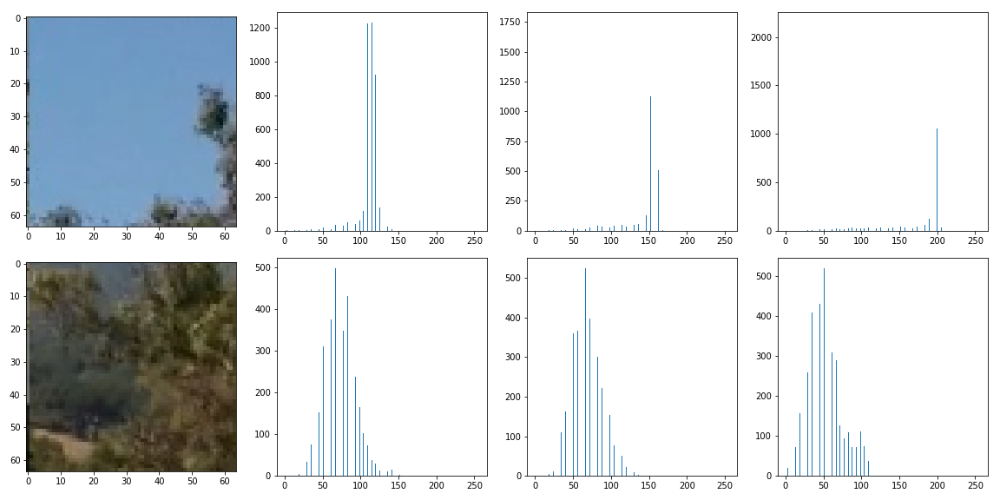
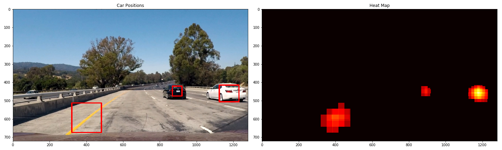

## Project 5 - Vehicle Detection
** This is [the final project for Term 1 of Udacity Self-Driving Cars Nanodegree](https://github.com/udacity/CarND-Vehicle-Detection). In this project, I have developed a vehicle detection pipeline using Scikit-Image, OpenCV, Scikit-learn, scipy and numpy, in which following steps are included**

* **Feature extraction using Histograms of Color, Spatial Binning of images, and Histogram of Oriented Gradients (HOG)**
* **Feature normalization**
* **Train a classifier Linear SVM classifier**
* **Multi-scale sliding-window search**
* **Outlier detection using heat maps**
* **Wrap the pipeline in a Python script along with the lane detection pipeline**

**The pipeline has been applied to the project video along with my [lane detection pipeline](https://github.com/siyaoxu/Self-Driving-Cars/tree/master/CarND-Advanced-Lane-Lines). The result of the video is documented below.**

|  |
| :--------------------------------------: |
| [Youtube Link](https://youtu.be/TIa2T7WfsFw) |

---
### Quick Start
The pipeline includes following files and folders:
```python
lane_detection_utils.py
line.py
vehicle_detection_utils.py
svm-classifier-training.py
video_detection.py
./camera_cal
./dataset
svc-clf.sav
```
`lane_detection_utils.py` and `line.py` are functions and the line class used my the lane detection pipeline. `vehicle_detection_utils.py` are functions used by the vehicle detection pipeline. `svm-classifier-training.py` load the training data [[vehincle](https://s3.amazonaws.com/udacity-sdc/Vehicle_Tracking/vehicles.zip), [not vehicle](https://s3.amazonaws.com/udacity-sdc/Vehicle_Tracking/non-vehicles.zip)] in `./dataset`, preprocess the data, extract features and labels, and train a linear Support Vector Machine (SVM). The model parameter `C` is tuned with Scikit-learn's `RandomizedSearchCV`. Paths to store the training dataset and to store the SVM model can be set in this script along with other model training parameters. `vehicle_detection.py` is the the script takes input images, performs sliding-window searching, and uses the SVM model to classify patches of vehicles. This script also corrects distortions caused by the camera, and draw detected objects and lanes onto the distorted image. Images in `./cameral_cal` are those images used to correct distortion, which are borrowed from the lane detection project. `svc-clf.sav` is the stored model. To run the scripts, simply use `python script_name.py`.

### Training dataset
The training dataset can be downloaded at [vehincle](https://s3.amazonaws.com/udacity-sdc/Vehicle_Tracking/vehicles.zip) and [not vehicle](https://s3.amazonaws.com/udacity-sdc/Vehicle_Tracking/non-vehicles.zip). There are 8792 vehicle images and 8968 non-vehicle images. All images have been resize to 64x64x3. Two images of each category are shown below.
 

### Feature extraction
I have explored a set of color spaces, including RGB, HSV, YUV, LUV, HLS, and YCrBr. My best results are obtained in LUV space. I have have extracted three types of features from the images in the LUV space, which will be discussed in following sections.

* Histogram of color
* Spatial binning features
* HOG features

#### Histogram of Color
Histograms of color are simply the histograms of each channel of an image, which characterize the color of the content. The histograms of color for the four images above are plotted at here. The significant difference in color between the two non-vehicle images can be clearly characterized by their histograms. However, the histograms of the car images are similar due to the similarity of their major color.




#### Spatial Binning features
Spatial binning is simply the original images resized to coarser pixelss, which attempts to capture multiscale information of images and to reduce the dimension of features. This is easily implemented with `cv2.resize()` function. Mu choice is consistent with Udacity's lecture, so all training images have been binned spatilly to 32x32 pixels.

#### Histogram of Oriented Gradients (HOG)
HOG feature attempts to characterize the structure information of the content of images. In order to calculate HOG, the gradient of a single channel of an image is first generated, and the direct of gradient then are summarized locally with a chosen window. This local gradient direction information captures locan structures of the content of an image. Then we take histograms of direction of gradients, to summarize the strucure information of a whole image. I have applied to use HOG of every single channel of the LUV space, but my final choice is using HOG of all three channels. This gives the best results. HOG of the example images are presented below. The feature maps to the right clearly show architectures of each image. In HOG, the directions of gradients are also binned to a chosen number of directions in order to obtain usabl direction information. I chose to use 8 rather than 9 binned directions, which is consistent with the common 8 directions in our life, e.g. North , East, Northeast. This choice has slightly improved the prediction accuracy of our SVM model in my experiments. Other parameters of HOG in my pipeline are the same as those in the Udacity lecture.


#### Feature normalization
The features must be normalized to similar magnitudes before training a classifier. This is done by using `StandardScaler()` of `Scikit-learn`. The scaler must be stored along with the trained classifier, which must be applied to every image patch before making prediction with the classifier. The original and normalized magnitude of example images above are shown below. The normalized magnitude of features (right plots of each row) are comparable.
LK
'


#### Classifier Training
My classifier is trained in script `svm-classifier-training.py`. As long as training data paths and other training parameters are set in correctly in this script, we can run it directly in the commandline console. Scikit-learn's `RandomizedSearchCv()` was used to optimize the only tuning parameter `C` of `LiearnSVM, and the trainging and test accuracy of my model is greater than 98%. This is not sufficient to correctly prediction every patch from an image, but the results are reasonable by applying following post-classification steps.

#### Sliding Window & Multiscale Search
The sliding window search algorithm is implemented in `slide_window()` function in `vehicle_detection_utils.py`. An example of the sliding window search is demonstratd below. The overlap of two consecutive patch is 0 in this plot, but we can adjust how much overlap we are going to use.


The size of searching windows and the overlap between to consecutive windows are the most significant parameters to the search results. Since the size of vehicles varies based on their distance to the camera, multiple window sizes must be applied in order to catch vehicles of various sizes. I have applied 4 different grid sizes in four regions, which are documented in the table below. The closer to the camera, the bigger the searching window is. By trial and error, I chose the overlap to be 0.6.

|                     |         |         |         |          |  
|:-------------------:|:-------:|:-------:|:-------:|:--------:|
| window size (x,y)   |(60,60)  |(70,70)  |(100,100)|(130,130) |
|region range (y1, y2)|(400,500)|(420,550)|(450,600)|(480,None)|

The multiple search grid is as follows.

Search results on `test1.jpg` is 


#### Heat Map for False Positive
False positive detection is implemented in functions `vehDetect()`, `addHeat()`, and `apply_threshold()`, which are in `vehhicle detection pipeline.py`. Heat maps of searched vehicle patches have been used to filter false positives on an image. The heat map of the above searched images is 


We can see vehicles have been successfully detected, but the left sidewall of the highway, and yellow lane lines have been misclassified to be vehicles.

####Pipeline
The pipeline has been tested on all test images provided in the project, and results are as follows. The common problem of this pipeline is that the sidewalls on the left and the yellow lines have often been misclassified as vehecles. Test results on the project video is better than on test images. My hypothesis is that the brightness and color of contents in the video are simpler than test images, which includes shadow and color changes on the road surfaces. 


---

###Discussion

I have implemented the pipeline and have tested it on the video and test images. My pipeline can successfully detect vehicles images. However, yellow lane lines and sidewalls of the highway can be misclassified to be vehicles. My assumption is that my pipeline cannot handle complex brightness and color changes in images. Possible improvements are 
* Using features from multiple color spaces
* Switching to a more powerful classifier, such as an ensemble tree model or a deep learning model

