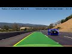
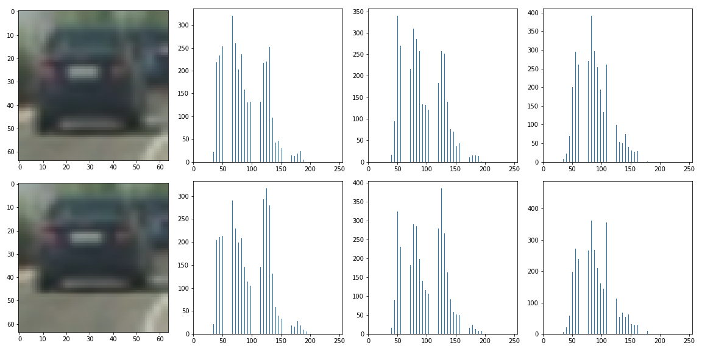
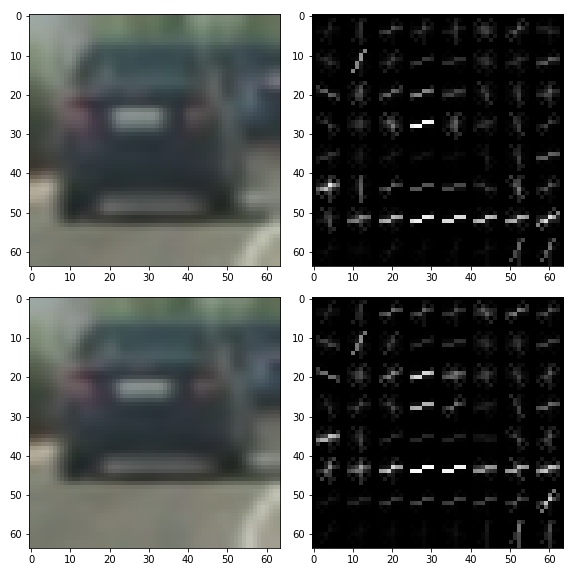
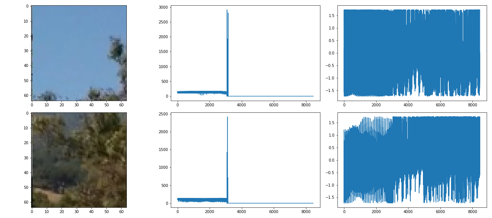
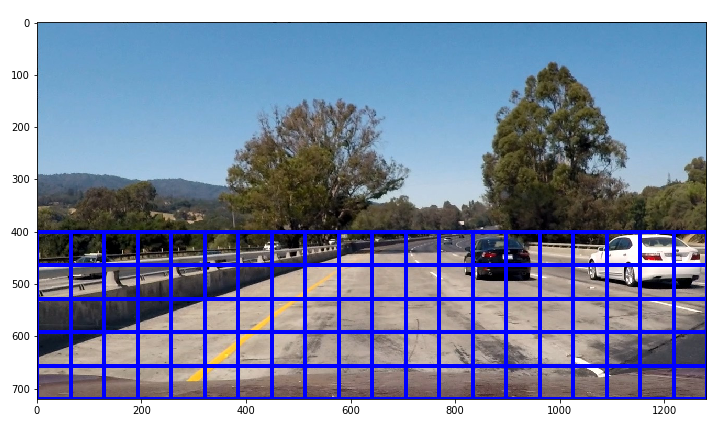
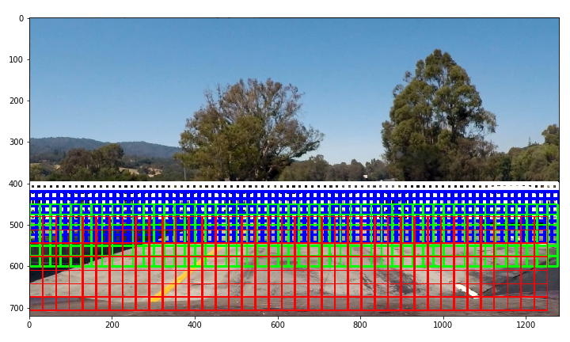
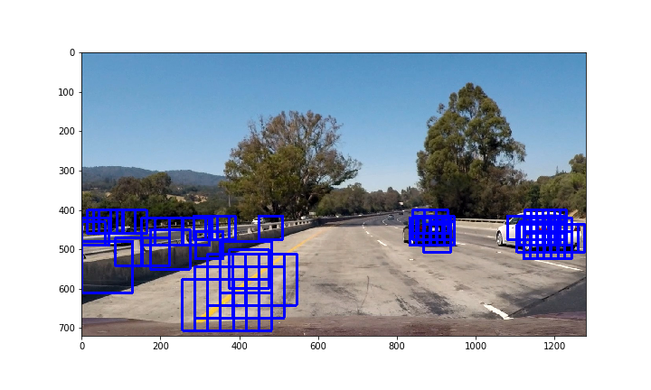
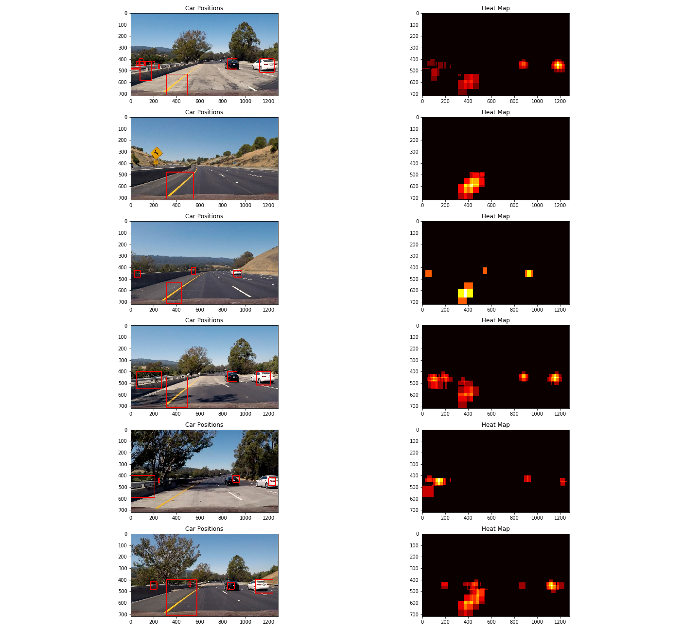

## Project 5 - Vehicle Detection
**This is the final project for Term 1 of Udacity Self-Driving Cars Nanodegree [[here]](https://github.com/udacity/CarND-Vehicle-Detection). In this project, I have developed a vehicle detection pipeline using Scikit-Image, OpenCV, Scikit-learn, scipy and numpy, in which following steps are included**

* **Feature extraction using Histograms of Color, Spatial Binning of images, and Histogram of Oriented Gradients (HOG)**
* **Feature normalization**
* **Train a Linear SVM classifier to identify image patches of vehicles** 
* **Multi-scale sliding-window search**
* **Outlier detection using heat maps**
* **Wrap the pipeline in a Python script along with the lane detection pipeline**

**The pipeline has been applied to the project video along with my [lane detection pipeline](https://github.com/siyaoxu/Self-Driving-Cars/tree/master/CarND-Advanced-Lane-Lines). The result of the video is documented below.**

|  |
| :--------------------------------------: |
| [Youtube Link](https://youtu.be/Tj3xsN6FeUo) |

---
### Quick Start
The pipeline includes following files and folders:
```python
lane_detection_utils.py
line.py
heat.py
vehicle_detection_utils.py
svm-classifier-training.py
video_detection.py
./camera_cal
./dataset
svc-clf.sav
```
`lane_detection_utils.py` and `line.py` are functions and the line class used my the lane detection pipeline. `vehicle_detection_utils.py` are functions used by the vehicle detection pipeline. `heat.py` is a class to track and average heat maps of detected object the the latest n frames, which is similar to `line.py`. `svm-classifier-training.py` load the training data [[vehincle](https://s3.amazonaws.com/udacity-sdc/Vehicle_Tracking/vehicles.zip), [not vehicle](https://s3.amazonaws.com/udacity-sdc/Vehicle_Tracking/non-vehicles.zip)] in `./dataset`, preprocess the data, extract features and labels, and train a linear Support Vector Machine (Linear SVM). The model parameter `C` is tuned with Scikit-learn's `RandomizedSearchCV`. Paths to store the training dataset and to store the SVM model can be set in this script along with other model training parameters. `vehicle_detection.py` is the the script takes input images, performs sliding-window searching, and uses the SVM model to classify patches of vehicles. This script also corrects distortions caused by the camera, and draw detected objects and lanes onto the distorted image. Images in `./cameral_cal` are those images used to correct distortion, which are borrowed from the lane detection project. `svc-clf.sav` is the stored model. To run the scripts, simply use `python script_name.py`.

### Training dataset
The training dataset can be downloaded at [vehincle](https://s3.amazonaws.com/udacity-sdc/Vehicle_Tracking/vehicles.zip) and [not vehicle](https://s3.amazonaws.com/udacity-sdc/Vehicle_Tracking/non-vehicles.zip). There are 8792 vehicle images and 8968 non-vehicle images. All images have been resize to 64x64x3. Two images of each category are shown below.
 

### Feature extraction
I have explored a set of color spaces, including RGB, HSV, YUV, LUV, HLS, and YCrBr. My best results are obtained in LUV space. I have extracted three types of features from the images in the LUV space, which will be discussed in following sections.

* Histogram of color
* Spatial binning features
* HOG features

#### Histogram of Color
Histograms of color are simply the histograms of each channel of an image, which characterize the color of the content. The histograms of color for the four images above are plotted at here. The significant difference in color between the two non-vehicle images can be clearly characterized by their histograms, and the histograms of the vehicle images are similar due to the similarity between their major color.




#### Spatial Binning features
Spatial binning is simply resizing the original images to coarser pixels, which attempts to capture multiscale information of images and to reduce the dimension of the feature space. This is easily implemented with `cv2.resize()` function. My choice is consistent with Udacity's lecture, so all training images have been binned spatilly with the bin size of 32x32.

#### Histogram of Oriented Gradients (HOG)
HOG features attempts to characterize the structure information of the content of images. In order to calculate HOG, the gradient of a single channel of an image is first generated, and the direction of gradient then are summarized locally within a chosen window. This local gradient direction information captures local structures of the content of an image. Then we take histograms of direction of gradients, to summarize the structure information of a whole image. I have tested using HOG of single channels of the LUV space, but my final choice is using all three channels to improve the performance of my pipeline. In HOG, the directions of gradients are also binned to a chosen number of directions in order to obtain usable directional information. I chose to use 8 rather than 9 binned directions, which is consistent with the common 8 directions in our life, e.g. North , East, Northeast. This choice has slightly improved the prediction accuracy of my Linear SVM model. Other parameters of HOG in my pipeline are the same as those in the Udacity lecture. HOG of the example images are presented below. The feature maps to the right clearly show architectures of each image.




#### Feature normalization
Features must be normalized to similar magnitudes before inputting to a classifier. This is done by using `StandardScaler()` of `Scikit-learn`. The scaler has been stored along with the trained classifier, which must be applied to every image patch before making prediction with the classifier. The original and normalized magnitude of features of example images are shown below. The normalized magnitude of features (right plots of each row) are comparable.




#### Classifier Training
I have chosen `Scikit-learn's` LinearSVC as my classifier model, because the training process of this implementation is the fastest among all SVM algorithms in `Scikit-learn`. The training and test accuracy are both above 98%, which is sufficient for this application. In SVM category, SVC with RBF kernel will probably slightly improve the accuracy, but I do not have sufficient time to tune my model with this implementation in `Scikit-learn`. Other models, such as ensemble trees and CNN classifier, are also worth to be tested. An operational model will probably be an ensemble model of all those listed in this chapter.

My classifier is trained in script `svm-classifier-training.py`. As long as training data paths and other training parameters are set in correctly in this script, we can run it directly in the console.

#### Sliding Window & Multiscale Search
The sliding window search algorithm is implemented in `slide_window()` function in `vehicle_detection_utils.py`. An example of the sliding window search is demonstratd below. The overlap of two consecutive patch is 0 in this plot, but we can adjust how much overlap we are going to use. An example of the grid of one round of sliding window search is shown below.


The size of searching windows and the overlap between two consecutive windows are the most significant parameters to the search results. Since the size of vehicles varies based on their distance to the camera, multiscale windows must be applied in order to catch vehicles of various sizes. I have applied 4 different grid sizes in four regions, which are documented in the table below. The closer to the camera, the bigger the searching window is. By trial and error, I chose the overlap to be 0.7. Bounding boxes in the results will not be stable if this value is too low.

|                       | Window 1  | Window 2  | Window 3  |  Window 4  |
| :-------------------: | :-------: | :-------: | :-------: | :--------: |
|   window size (x,y)   |  (60,60)  |  (70,70)  | (100,100) | (130,130)  |
| region range (y1, y2) | (400,500) | (420,550) | (450,600) | (480,None) |

The multiple search grids are plotted on a test image below.


Search results on `test1.jpg`  below indicate that my classifier can identify vehicles along with some other objects in the image. Those incorrect detections can be corrected with heat maps documented in next chapter.


#### Heat Map for False Positive
False positive detection is implemented in functions `vehDetect()`, `addHeat()`, and `apply_threshold()`, which are in `vehhicle detection pipeline.py`. Heat maps of searched vehicle patches can be used to identify incorrectly predicted objects. The heat map of the above searched images is 


We can see vehicles have been successfully detected, but the left sidewall of the highway, and yellow lane lines have been incorrectly predicted as vehicles. Since the incorrect predictions are normally low in terms the density in the heat map, we can simply filter those region with a threshold. This threshold is also significant to our results. A threshold that is too low will not filter out incorrect predictions, while a high threshold will filter correct predictions. I have used 2 in `video_detection.py`, which has given me a good result along with other parameters.

#### Historic Heatmap
Filtering heat maps along will not generate satisfiying results, because there are still incorrect predictions remained in every one or two frames of a video. These incorrect predictions randomly appears, hence it is unlikly that they appear in two consecutive frames and in similar regions. I have defined a `Heatmap` class in `heat.py` to store identified objects in the latest `n` frames, and the prediction for each new frame is obtaind by filtering the average heatmap of the latest `n` frames. This strategy has effectively eliminated the incorrect predictions in my results. My choice of `n` is 30.

#### Pipeline
The pipeline has been tested on all test images provided in the project, and results are as follows. Although there are also incorrect predictions in those single image tests, the result on the video is much improved by the historic map strategy, and the link is shown in the beginning of this document. 



---

### Discussion

I have implemented the pipeline and have tested it on the video and test images. My pipeline can successfully detect vehicles images. Although there are incorrect predictions on single test images, they can be effectively removed by using the historic heatmap for videos. Hyperparameters that are most significant results are the size of searching windows, overlap between two searching windows, the threshold on heatmaps, and the number of consecutive frames to be used for calculating average heatmaps. In order to implement an operational pipeline for a business project, possible improvements based on this pipeline are
* Fine tune the combination of the size and overlap of searching windows, the threshold on heatmaps, and the number of consecutive frames for averaging heatmaps
* Use more features to capture more comprehensive contents of images
* Use more types of data such as Lidar
* Using an ensemble classifier that combines results of a number of different types of models

